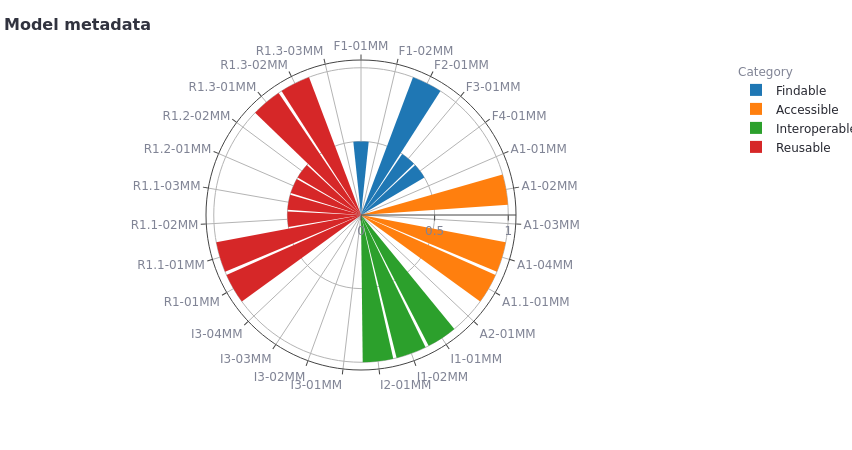

# fair-ca-visualization
Computational models are essential tools for studying complex systems which,
particularly in clinical settings, need to be quality-approved and transparent.
A community-driven approach to enhance the transparency and communication of
model features is adherence to the principles of Findability, Accessibility,
Interoperability and Reusability (FAIR). We propose here an adaptation of the
FAIR indicators published by the Research Data Alliance to assess the
FAIRness of models encoded in domain-specific standards, such as those
established by [COMBINE](https://co.mbine.org).

The visualization tool is available from: https://faircombine.streamlit.app/

[](https://faircombine.streamlit.app/)

# Local installation
The app has been implemented as streamlit application and can be run locally.

Setup virtual environment and install the dependencies
```bash
mkvirtualenv fairvis --python=python3.12
pip install -r requirements.txt
```
Clone the repository
```bash
git clone https://github.com/matthiaskoenig/fair-ca-visualization.git
```

Start the application
```bash
streamlit run src/fairvis/app.py
```

# License

* Source Code: [LGPLv3](http://opensource.org/licenses/LGPL-3.0)
* Documentation: [CC BY-SA 4.0](http://creativecommons.org/licenses/by-sa/4.0/)

The fair-ca-visualization source is released under both the GPL and LGPL licenses version 2 or
later. You may choose which license you choose to use the software under.

This program is free software: you can redistribute it and/or modify it under
the terms of the GNU General Public License or the GNU Lesser General Public
License as published by the Free Software Foundation, either version 2 of the
License, or (at your option) any later version.

This program is distributed in the hope that it will be useful, but WITHOUT ANY
WARRANTY; without even the implied warranty of MERCHANTABILITY or FITNESS FOR A
PARTICULAR PURPOSE. See the GNU General Public License for more details.

Funding
=======
Matthias König (MK) was supported by the Federal Ministry of Education and Research 
(BMBF, Germany) within the research network Systems Medicine of the Liver 
(**LiSyM**, grant number 031L0054). MK is supported by the Federal Ministry of 
Education and Research (BMBF, Germany) within ATLAS by grant number 031L0304B and 
by the German Research Foundation (DFG) within the Research Unit Program FOR 5151 
QuaLiPerF (Quantifying Liver Perfusion-Function Relationship in Complex Resection - 
A Systems Medicine Approach) by grant number 436883643 and by grant number 
465194077 (Priority Programme SPP 2311, Subproject SimLivA).

© 2024 Matthias König
